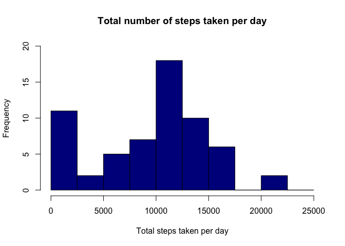
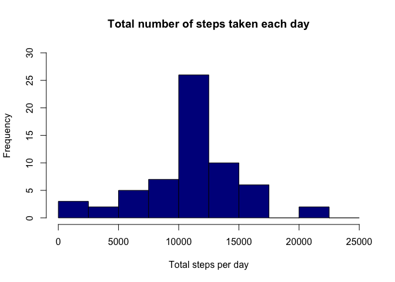

```r
knitr::opts_chunk$set(warning=FALSE)
```


```r
library(ggplot2)

activity <- read.csv("/Users/mikemiller/Downloads/activity.csv")
activity$date <- as.POSIXct(activity$date, "%Y-%m-%d")
weekday <- weekdays(activity$date)
activity <- cbind(activity, weekday)
```

### 2. Histogram of the total number of steps taken each day


```r
activity_total_steps <- with(activity, aggregate(steps, by = list(date), FUN = sum, na.rm = TRUE))
names(activity_total_steps) <- c("date", "steps")
hist(activity_total_steps$steps, main = "Total number of steps taken per day", xlab = "Total steps taken per day", col = "darkblue", ylim = c(0,20), breaks = seq(0,25000, by=2500))
```

<!-- -->


### 3. Mean and Median number of steps taken each day


```r
mean(activity_total_steps$steps)
```

```
## [1] 9354.23
```

```r
median(activity_total_steps$steps)
```

```
## [1] 10395
```

### 4.  Time series plot of the average number of steps taken


```r
average_daily_activity <- aggregate(activity$steps, by=list(activity$interval), FUN=mean, na.rm=TRUE)
names(average_daily_activity) <- c("interval", "mean")
plot(average_daily_activity$interval, average_daily_activity$mean, type = "l", col="red", lwd = 2, xlab="Interval", ylab="Average number of steps", main="Average number of steps per intervals")
```

<!-- -->

### 5. The 5-minute interval that, on average, contains the maximum number of steps


```r
average_daily_activity[which.max(average_daily_activity$mean), ]$interval
```

```
## [1] 835
```

### 6. Code to describe and show a strategy for imputing missing data


```r
sum(is.na(activity$steps))
```

```
## [1] 2304
```

```r
imputed_steps <- average_daily_activity$mean[match(activity$interval, average_daily_activity$interval)]
activity_imputed <- transform(activity, steps = ifelse(is.na(activity$steps), yes = imputed_steps, no = activity$steps))
total_steps_imputed <- aggregate(steps ~ date, activity_imputed, sum)
names(total_steps_imputed) <- c("date", "daily_steps")
```

### 7. Histogram of the total number of stdeps taken each day after missing values are imputed


```r
hist(total_steps_imputed$daily_steps, col = "darkblue", xlab = "Total steps per day", ylim = c(0,30), main = "Total number of steps taken each day", breaks = seq(0,25000,by=2500))
```

<!-- -->

### 8. Panel plot comparing the average number of steps taken per 5-minutes interval across weekdays and weekends


```r
activity$date <- as.Date(strptime(activity$date, format="%Y-%m-%d"))
activity$datetype <- sapply(activity$date, function(x) {
    if (weekdays(x) == "Saturday" | weekdays(x) =="Sunday") 
    {y <- "Weekend"} else 
    {y <- "Weekday"}
    y
})

activity_by_date <- aggregate(steps~interval + datetype, activity, mean, na.rm = TRUE)
plot<- ggplot(activity_by_date, aes(x = interval , y = steps, color = datetype)) +
    geom_line() +
    labs(title = "Average daily steps by type of date", x = "Interval", y = "Average number of steps") +
    facet_wrap(~ datetype, ncol = 1, nrow=2)

plot
```

<!-- -->


